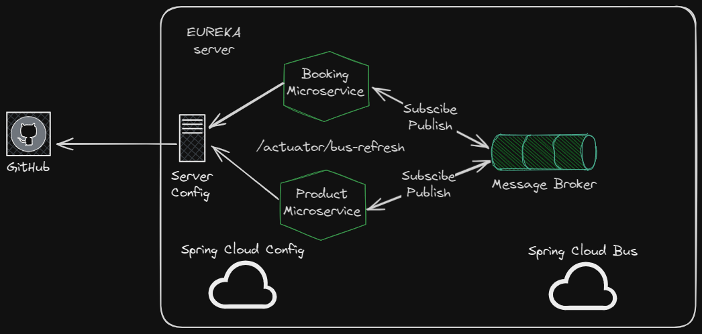
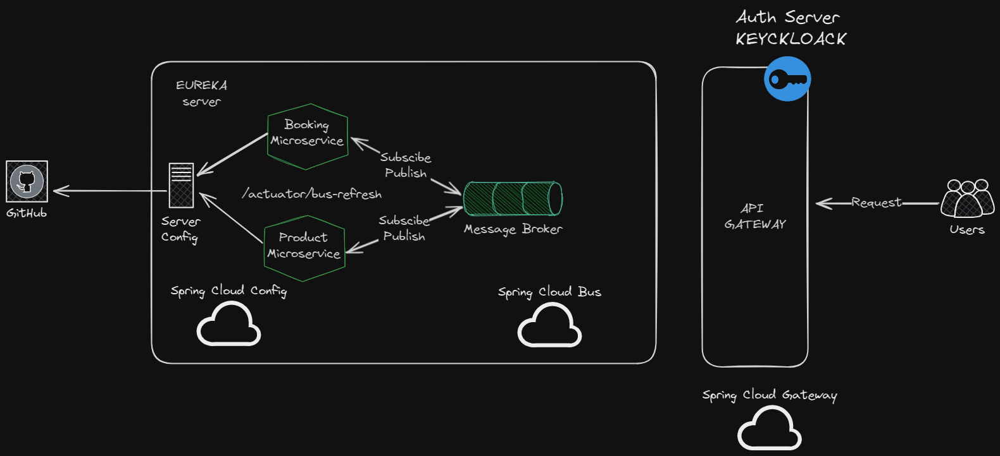

# Microservices

Implementation an example of manage microservices architecture

To run these microservice:
1- First you need to run your eureka server in the project Discovery-Server.
2- You need to run your config server
3- You need to run your microservices

# 1- Implementing a Discovery Server

**Problem:**

In microservices, there are scenarios where you require additional instances of a specific microservice due to high demand. Consider a situation where microservice A communicates with B. If we need to scale up B to five instances, we must manually update the URLs in microservice A to include these new instances. This involves making changes, committing, and pushing to the repository.

**Solution:**

Implementing a Discovery Server addresses this issue effectively. The Discovery Server maintains a registry of all microservices. When additional instances of a microservice are required, the Discovery Server automatically updates the routes without requiring manual intervention. This server is like a microservices monitoring.

# 2- Implementing a Config Server

**Problem:**

In a microservice architecture, updating configurations (e.g., application.properties) requires multiple steps, including making changes, committing code, possibly creating a pull request (PR), and then redeploying the microservice.

**Solution:**

Implement a configuration server connected to a GitHub repository. This repository would store the configuration files. When updates are needed, simply modify the configuration file, commit, and push the changes to the repository. This streamlined process eliminates the need for additional steps like creating PRs and redeploying the microservice.

When you do the config server is so important that you do this with a new propertye file called bootstrap.properties, the config reads first this file before application.properties.

Link repo files configurations: https://github.com/eduardo732/service-configuration
If you want to see the config server just open /config-server folder

### Refresh configuration

Once you implemented config server you need to configurate microservices.
You need to add
**Springboot Actuator**
In essence, Actuator brings production-ready features to our application.Monitoring our app, gathering metrics, and understanding traffic or the state of our database becomes trivial with this dependency.
**@RefreshScope**
this anotation will be in a controller endpoint, so when you call this endpoint, the configuration file will update.

In your bootstrap.properties you need to add this annotation:
management.endpoints.web.exposure.include=\*
with this you can refresh configurations.
Then if you did some change in the configuration files and you want that the microservice X update the configuration you need to call this endpint:
http:..../actuator/refresh
This automaticatly refresh all configuration variables on your microservice.
you can automate this last part you can implement a message broker that listening the changes and update the microservices.

# 3- Vault

Secure, store, and tightly control access to tokens, passwords, certificates, and encryption keys for protecting secrets and other sensitive data using a UI, CLI, or HTTP API.
https://www.vaultproject.io/

- Download vault
- Add to Path Variables
- Open vault file folder
- Open terminal
- Check documentation.

# 4- Message Broker, Refresh Configuration, RabbitMQ, Docker

Mainly you need this message broker to refresh automatically your configurations on your microservices.

to update all your configs on your microservices, you need to call to Config Server on /actuator/busrefresh and then your microservices will be update.

# 5- API Gateway

- Intercept every call from clients and it rotues to specific microservice
- You can implement authentication and authorization
- Monitoring
- Limit speed of api calls

You need to configurate your api-gateway properties with these configurations:
(Example)

- spring.cloud.gateway.routes[0].id=product-microservice --> An id to identify your microservice
- spring.cloud.gateway.routes[0].uri=lb://PRODUCT-MICROSERVICE --> lb=loadbalancer and the name in the EUREKA SERVER in this case is PRODUCT-MICROSERVICE
- spring.cloud.gateway.routes[0].predicates[0]=Path=/api/products/.., /api/categories/.. --> All routes in your api, inside cloud gateway it is called predicates

# 6- Authentication and Authorization KEYCLOACK

You can add this security layer into your api gateway... go to keycloak.org and follow the instructions...

https://www.youtube.com/watch?v=7gMQYCvTd8c&list=PL145AyWAbMDhwUbBL74s1D2ZV9EqBaQ1t&index=9

- Pull and download docker server keycloack
- Start your keycloack server
- You need to configurate your realm
- Create a client --> example spring-cloud-gateway-client
- Finish to configurate your client
- You copu the secret keycloack
- Add an user
- You add some dependencies to your api gateway service(Spring cloud starter security, Springboot starter OAuth2-client)
- Add configurations into application.properties
	-spring.security.oauth2.client.provider.keycloack.issuer-uri=urlKeycloackIssuer
	-spring.security.oauth2.client.registration.spring-cloud-gateway-client.client-id={cleintId From Keycloack}
	-spring.security.oauth2.client.registration.spring-cloud-gateway-client.client-secret={clientSecret From Keycloack}
	-spring.security.oauth2.client.registration.spring-cloud-gateway-client.provider=keycloack
	-spring.security.oauth2.client.registration.spring-cloud-gateway-client-authorization-grand-type={auth from keycloack}
	-spring.security.oauth2.client.registration.spring-cloud-gateway-client.redirec-uri={your url that happen when the auth is success}
-Add Security Configuration in your microservice