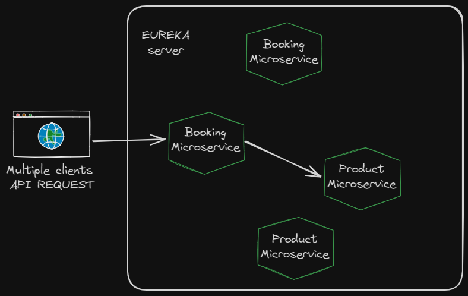
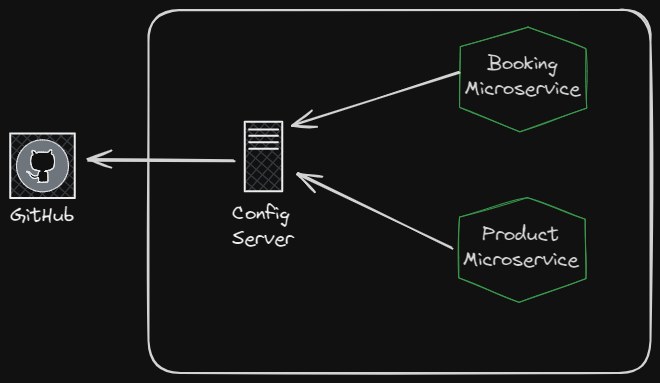

# Microservices
Implementation an example of manage microservices architecture

# 1- Implementing a Discovery Server

**Problem:**

In microservices, there are scenarios where you require additional instances of a specific microservice due to high demand. Consider a situation where microservice A communicates with B. If we need to scale up B to five instances, we must manually update the URLs in microservice A to include these new instances. This involves making changes, committing, and pushing to the repository.

**Solution:**

Implementing a Discovery Server addresses this issue effectively. The Discovery Server maintains a registry of all microservices. When additional instances of a microservice are required, the Discovery Server automatically updates the routes without requiring manual intervention. This server is like a microservices monitoring.

# 2- Implementing a Config Server

**Problem:**

In a microservice architecture, updating configurations (e.g., application.properties) requires multiple steps, including making changes, committing code, possibly creating a pull request (PR), and then redeploying the microservice.

**Solution:**

Implement a configuration server connected to a GitHub repository. This repository would store the configuration files. When updates are needed, simply modify the configuration file, commit, and push the changes to the repository. This streamlined process eliminates the need for additional steps like creating PRs and redeploying the microservice.

 Link repo files configurations: https://github.com/eduardo732/service-configuration
 If you want to see the config server just open /config-server folder

 ### Refresh configuration

 Once you implemented config server you need to configurate microservices.
 You need to add
 /actuaror/refresh
 @RefreshScope